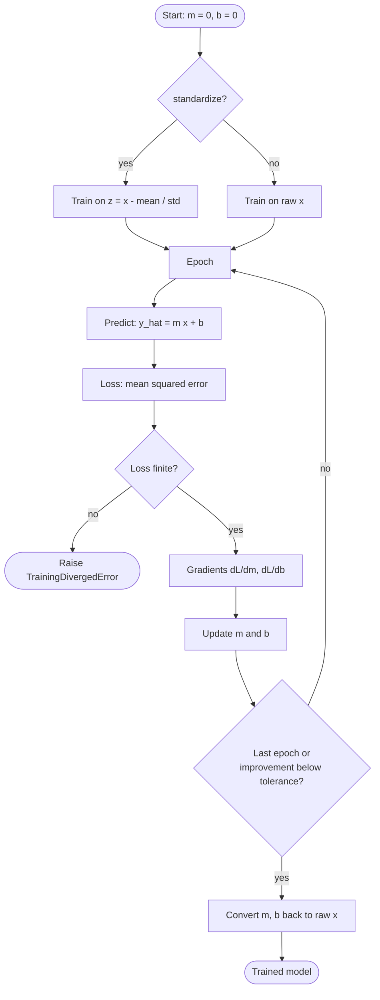

# learnix — Machine Learning From Scratch: Linear Regression and Gradient Descent in Pure Python

[](https://github.com/shivkumarsinghsky/learnix/actions/workflows/ci.yml)


A learning repository by **Shiv Kumar** that builds machine learning fundamentals step by step,
starting with linear regression. Every concept is first written as a few lines of plain Python
in a numbered lesson, then collected into a small tested package, `learnix`, and finally
checked against scikit-learn.

The goal is understanding, not speed: there is no NumPy in the core, so each line of code maps
to one line of the maths below.

## Contents

- [Learning path](#learning-path)
- [The maths](#the-maths)
- [How training works](#how-training-works)
- [Results](#results)
- [Quick start](#quick-start)
- [Using the package](#using-the-package)
- [Project structure](#project-structure)
- [Testing](#testing)
- [Design decisions](#design-decisions)
- [Roadmap](#roadmap)
- [Related Projects](#related-projects)
- [Author](#author) · [License](#license)

## Learning path

| # | Lesson | Concept | Key idea |
|---|---|---|---|
| 1 | [01_prediction.py](lessons/01_prediction.py) | Hypothesis | A model is a line: `salary = m * experience + b` |
| 2 | [02_residuals.py](lessons/02_residuals.py) | Residuals | Error per sample: `actual - predicted` |
| 3 | [03_mean_squared_error.py](lessons/03_mean_squared_error.py) | Loss function | One number for "how wrong": mean of squared residuals |
| 4 | [04_gradient_descent.py](lessons/04_gradient_descent.py) | Optimisation | Follow the gradient downhill; what learning rate does |
| 5 | [05_train_save_load.py](lessons/05_train_save_load.py) | Real data | Feature scaling, checking against the exact solution, saving a model |
| 6 | [06_scikit_learn_comparison.ipynb](notebooks/06_scikit_learn_comparison.ipynb) | Library | The same model with scikit-learn, with a train/test split |

## The maths

For samples $(x_i, y_i)$, $i = 1 \dots n$:

**Prediction**

$$\hat{y}_i = m x_i + b$$

**Loss: mean squared error**

$$L(m, b) = \frac{1}{n} \sum_{i=1}^{n} \left(y_i - \hat{y}_i\right)^2$$

**Gradients**

$$\frac{\partial L}{\partial m} = -\frac{2}{n} \sum_{i=1}^{n} x_i \left(y_i - \hat{y}_i\right)
\qquad
\frac{\partial L}{\partial b} = -\frac{2}{n} \sum_{i=1}^{n} \left(y_i - \hat{y}_i\right)$$

**Update rule** with learning rate $\alpha$

$$m \leftarrow m - \alpha \frac{\partial L}{\partial m} \qquad b \leftarrow b - \alpha \frac{\partial L}{\partial b}$$

**Exact solution** (ordinary least squares), used to check gradient descent:

$$m = \frac{\sum (x_i - \bar{x})(y_i - \bar{y})}{\sum (x_i - \bar{x})^2} \qquad b = \bar{y} - m \bar{x}$$

**Feature scaling.** Training on $z = (x - \mu) / \sigma$ and converting back with
$m = m_z / \sigma$, $b = b_z - m_z \mu / \sigma$ gives the same line, but lets gradient descent
use a much larger learning rate.

## How training works



The learning rate is the most important setting:

| Learning rate (lesson 4) | Outcome after training on 4 points |
|---|---|
| `0.000001`, 100 epochs | Barely moves: m ≈ 22 instead of 5000 |
| `0.05`, 5000 epochs | Converges to m = 5000, b = 30000 |
| `0.5` | Loss explodes; training stops with `TrainingDivergedError` |

## Results

On the 50-row dataset in [data/salary.csv](data/salary.csv) (experience 1–23 years), lesson 5
produces:

| Method | Slope m | Intercept b | Notes |
|---|---|---|---|
| Gradient descent (`standardize=True`, `learning_rate=0.1`) | 5,694.78 | 27,275.20 | Stops early after 82 epochs |
| Closed-form least squares | 5,694.78 | 27,275.20 | Exact answer |
| scikit-learn `LinearRegression` | same within 1e-6 relative | same within 1e-6 relative | Checked by `tests/test_linear_regression.py` |

On the full dataset the fitted line has R² = 0.998 and MSE ≈ 2.1 million (an RMSE of about
1,460 in salary units). These numbers describe a small illustrative dataset, not real salaries.

## Quick start

```bash
git clone https://github.com/shivkumarsinghsky/learnix.git
cd learnix
python -m venv .venv && source .venv/bin/activate
pip install -e ".[dev]"

python lessons/01_prediction.py
python lessons/04_gradient_descent.py
python lessons/05_train_save_load.py
```

For the notebook:

```bash
pip install -r requirements-notebooks.txt
jupyter notebook notebooks/06_scikit_learn_comparison.ipynb
```

## Using the package

```python
from learnix import LinearRegression, fit_closed_form, load_csv_xy, r2_score

xs, ys = load_csv_xy("data/salary.csv", "experience_years", "salary")

model = LinearRegression(learning_rate=0.1, epochs=2000, standardize=True, tolerance=1e-6)
model.fit(xs, ys)
print(model.m, model.b, r2_score(ys, model.predict(xs)))

model.save("salary_model.json")          # plain JSON: parameters and hyperparameters
same = LinearRegression.load("salary_model.json")
```

## Project structure

```text
learnix/
├── lessons/                 Numbered, runnable lessons (beginner-style code on purpose)
├── notebooks/               Lesson 6: scikit-learn comparison
├── data/salary.csv          50-row experience vs salary dataset
├── src/learnix/
│   ├── linear_regression.py LinearRegression: predict, loss, gradients, fit, save/load
│   ├── closed_form.py       Exact least-squares solution
│   ├── metrics.py           residuals, mean_squared_error, r2_score
│   └── data.py              Dependency-free CSV loader
├── tests/                   Unit tests, gradient checks, sklearn parity, lesson runs
└── docs/decisions/          Architecture Decision Records
```

## Testing

```bash
pytest          # 30 tests
ruff check . && ruff format --check .
mypy            # strict
```

The tests check the analytic gradients against numerical derivatives, convergence to the exact
least-squares solution, agreement with scikit-learn, the learning-rate failure modes, JSON
save/load, input validation, and that every lesson script still runs.

## Design decisions

- [ADR-001](docs/decisions/ADR-001-pure-python-core.md) — Pure Python core, no NumPy
- [ADR-002](docs/decisions/ADR-002-json-model-files-instead-of-pickle.md) — JSON model files instead of pickle
- [ADR-003](docs/decisions/ADR-003-verify-against-exact-solutions.md) — Verify training against exact solutions and scikit-learn

## Roadmap

Planned next topics, each following the same lesson → package → test pattern:

- Multiple linear regression (several features) and the normal equation
- Train/validation split and overfitting
- Logistic regression and cross-entropy loss
- Mini-batch and stochastic gradient descent

## Related Projects

- [RAG Enterprise Assistant](https://github.com/shivkumarsinghsky/rag-enterprise-assistant) — retrieval-augmented generation with evaluation
- [Enterprise AI Agent Platform](https://github.com/shivkumarsinghsky/enterprise-ai-agent-platform) — LangGraph agents with tools and human-in-the-loop
- [System Design Architecture](https://github.com/shivkumarsinghsky/system-design-architecture) — reference system designs

## Author

**Shiv Kumar** — Senior Software Engineer / Software Architect
GitHub: [github.com/shivkumarsinghsky](https://github.com/shivkumarsinghsky)

## License

[MIT](LICENSE)
